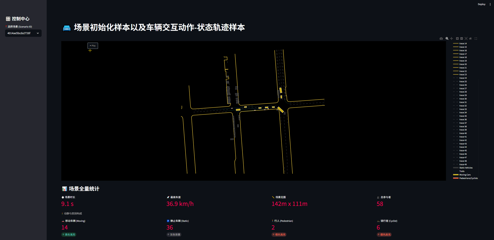

<div align="center">

# 🚘 Trajectory & Scenario Extractor
### 面向自动驾驶的场景初始化样本与交互轨迹自动化提取平台

[](https://www.python.org/)
[](https://streamlit.io/)
[](https://plotly.com/)
[](https://waymo.com/open/)
[](https://www.nuscenes.org/)
[](https://www.nuscenes.org/nuplan)
[](LICENSE)


[English](README_EN.md) | [简体中文](README.md)

<br>


<br>
<em>(Demo: 基于动静分离渲染的高精地图与交互轨迹全量回放)</em>

</div>

---

## 📖 项目简介 (Introduction)

**Trajectory & Scenario Extractor** 是一套通用的自动驾驶数据基础设施工具。它旨在打破 Waymo, nuScenes, nuPlan 及用户实采数据之间的数据壁垒，提供一套标准化的数据处理与验证流水线。

通过定义**统一中间数据模型 (UIDM)**，本工具实现了从原始二进制流到两类高价值训练样本的自动化转化：

1.  **场景初始化样本 (Scenario Initialization Samples)**
    - 自动截取 $T_0$ 时刻的静态道路拓扑与动态物体全域快照。
    - 识别并分离**静态背景车**与**动态交互车**。

2.  **交互动作-状态轨迹 (Interaction Action-State Trajectories)**
    - 生成时序对齐的车辆运动学状态（位置/速度/航向）。
    - 结合时空几何特征，提取**变道**、**跟车**、**停车**等高层语义动作标签。

---

## ✨ 核心特性 (Key Features)

- **🔄 多源异构数据归一化**
  - **全量数据集适配**：深度支持 Waymo Open Dataset (`.tfrecord`) 、nuScenes (`SQL`) 和 nuPlan (`SQLite`) 等主流数据集格式。
  - **统一坐标系转换**：将不同源数据（全局 UTM/WGS84）统一映射至 **ENU 局部笛卡尔坐标系**。
  - **配置驱动架构**：通过 `config.yaml` 灵活管理不同数据集的路径与提取参数。

- **🏎️ 动静分离与 VRU 识别**
  - **动态分层渲染**：视觉上分离静止车辆（灰色背景）与动态车辆（高亮黄色），解决轨迹重影问题。
  - **弱势群体关注**：专门针对 **行人 (Pedestrians)** 和 **骑行者 (Cyclists)** 进行高亮提取，辅助长尾场景挖掘。

- **📊 高性能可视化验证终端**
  - 基于 **Streamlit + Plotly WebGL**，支持百万级矢量地图元素的 60FPS 流畅渲染。
  - **全量数据透视**：提供微观运动学指标（速度/尺寸/偏航角）的像素级校验面板。
  - **宏观场景量化**：自动计算场景时长、覆盖范围、最高车速及参与者构成。

---
## 🛠️ 环境部署 (Installation)

本项目推荐使用 **Conda** 进行环境隔离，以避免依赖冲突。

### 1. 基础环境搭建 (Base Setup)
首先创建虚拟环境并安装核心依赖（支持可视化与基础数据处理）。

```bash
# 1. 创建虚拟环境 (推荐 Python 3.10)
conda create -n traj_extract python=3.10
conda activate traj_extract

# 2. 克隆项目代码
git clone https://github.com/aying999/Trajectory-Extractor.git
cd Trajectory-Extractor

# 3. 安装核心依赖 
pip install -r requirements.txt
```
### 2. 数据集 SDK 安装 (Dataset SDK Setup)
根据您需要处理的数据集类型，选择性安装对应的官方开发包（三选一或多选）。

```bash
# [Option A] Waymo Open Dataset (注意 TensorFlow 版本兼容性)
pip install waymo-open-dataset-tf-2-11-0==1.5.0

# [Option B] nuScenes Dataset
pip install nuscenes-devkit

# [Option C] nuPlan Dataset
pip install nuplan-devkit
```
## 🚀 使用教程 (Usage Guide)

### 1. 数据提取 (Data Extraction)
针对不同的数据集，请运行对应的提取脚本，将原始数据转换为标准中间格式 (UIDM)。

#### 🚗 Waymo Open Dataset (WOD)
运行 Waymo 提取脚本：
```bash
python extract_waymo.py --input_path data/segment-123.tfrecord --output_dir output/
```

### 🏙️ nuScenes Dataset
运行 nuScenes 提取脚本：
```bash
python extract_nuscenes.py --version v1.0-mini --dataroot data/nuscenes --output_dir output/
```
### 🗺️ nuPlan Dataset
运行 nuPlan 提取脚本：
```bash
python extract_nuplan.py --dataset_root data/nuplan --map_root data/maps --output_dir output/
```
### 2. 可视化配置 (Visualization Configuration)
在启动 app.py 之前，请修改根目录下的 config.yaml，指定您刚才提取好的 CSV 文件路径。


```yaml
# config.yaml 
示例：加载 Waymo 数据
paths:
  traj_file: "output/data_waymo.csv"
  map_file: "output/map_waymo.csv"
示例：加载 nuScenes 数据
paths:
  traj_file: "output/data_nuscenes.csv"
  map_file: "output/map_nuscenes.csv
```


### 3. 启动可视化终端 (Launch Visualization)
提取完成后，一键启动交互式验证平台。
```bash
streamlit run app.py --server.port 8501
```
终端启动后，请在浏览器访问地址：🔗 Local URL: http://localhost:8501

在界面中，您可以：

    左侧侧边栏：切换不同的 Scenario ID。

    顶部播放器：点击 ▶ Play 回放场景。

    底部数据面板：筛选特定 ID 查看微观状态数据。


## 🏗️ 系统架构 (System Architecture)

```mermaid
graph LR
    A[Multi-Source Raw Data] --> B(Data Processor)
    subgraph Sources
        W[Waymo]
        N[nuScenes]
        P[nuPlan]
    end
    W --> A
    N --> A
    P --> A
    B --> C{Unified Adapter}
    C -->|Static Layer| D[Map Topology]
    C -->|Dynamic Layer| E[Object Trajectories]
    D & E --> F[Unified CSV Output]
    F --> G[Visualization App]
    G --> H[Analysis & Verification]

